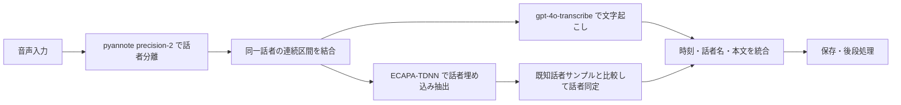

# 話者分離・話者同定・文字起こしの採用方針

作成日: 2026-04-22

## 背景

`diarize-log` は現在 `gpt-4o-transcribe-diarize` を中心に構成しているが、実運用では次の課題がある。

- 文字起こし本文と diarization の品質を同時に高く満たしにくい
- bundled API は一度に複数の役割を担うため、弱い部分だけを差し替えにくい
- `gpt-4o-transcribe` は本文品質とコストのバランスが良いが、発話時刻の扱いが弱い
- pyannote OSS は低頻度利用しやすいが、今回の検証では話者数推定とクラスタリングに弱さが出た

このため、話者分離・話者同定・文字起こしを分離し、ローカルで統合する構成へ寄せる。

## 既存比較から得た認識

`docs/survey/deepgram-vs-openai-20260422.md` の比較では、今回の対象データについて次の傾向があった。

- 文字起こし本文は Deepgram の方が良かった
- diarization は OpenAI が過分割、Deepgram が過少分割の傾向だった
- 2 人中心の会話では Deepgram が自然に見えやすい
- 3 人目の存在検出は OpenAI の方が拾いやすい
- ただし、どちらもそのまま本命にするには弱点がある

この結果から、bundled diarization を主軸にするよりも、話者分離を別系統へ切り出した方がよいと判断する。

## 採用する構成

### 採用する役割分担

- 話者分離: `pyannote` precision-2 API
- 話者同定: `SpeechBrain ECAPA-TDNN`
- 文字起こし: `gpt-4o-transcribe`
- 出力時刻: `pyannote` の区間時刻を採用
- オーケストレーション: ローカル実装

### この構成を選ぶ理由

- 話者分離は `pyannote` 系が最も信頼しやすく、precision-2 は OSS 実行より話者数推定とクラスタリングの品質を期待できる
- 話者同定は API 依存にせず、埋め込み比較を自前で持った方が制御しやすい
- 文字起こし本文は `gpt-4o-transcribe` を引き続き活かせる
- 時刻は diarization 側の区間時刻を使うことで補える
- separated pipeline は従来型 pipeline と切り替え可能にし、比較しながら移行できる

## 基本方針

1. 先に音声全体または capture 単位で diarization を行う
2. diarization の結果から、連続する同一話者区間をまとめる
3. まとめた区間ごとに `gpt-4o-transcribe` へ ASR リクエストを送る
4. その区間の音声から話者埋め込みを計算し、既知話者サンプルと比較して名前を付ける
5. diarization の start/end を使って transcript に時刻を付与する
6. capture をまたぐ場合は、話者埋め込み比較で同一人物をできるだけつなぐ

## `先に話者区間を切る` 方針について

この方針は妥当である。

特に、diarization の各細片をそのまま ASR に送るのではなく、**連続する同一話者区間をまとめてから ASR する**方がよい。

### 良い点

- API リクエスト回数を減らせる
- 短すぎる断片よりも文脈を保ちやすい
- 話し始めや言い直しを含めて自然な 1 発話に近づけやすい
- diarization の区間時刻をそのまま transcript に載せやすい

### 注意点

- 1 区間が長すぎると、逆に扱いづらくなる
- diarization の境界がきつすぎると、語頭や語尾を切りやすい
- 相槌や短い割り込みが多いと、同一話者でも細かく分かれる
- 重なり発話はこの構成でも難しい

### 実装上の扱い

初期実装では次のように扱うのが無難である。

- 同一話者が連続している区間は結合する
- ごく短い無音はまたいで結合する
- 先頭と末尾に少しだけ余白を持たせて切り出す
- 長すぎる区間は silence など自然な切れ目で再分割する
- 極端に短い断片は前後へ吸収するか、ノイズ候補として扱う

## 話者同定の考え方

話者同定は、1 発話ごとに直接人名を付けるより、**まとまった区間またはクラスタ単位で埋め込み比較する**方が安定しやすい。

基本の流れは次の通り。

1. 既知話者ごとにサンプル音声を保持する
2. サンプルから ECAPA-TDNN で話者埋め込みを作る
3. diarization 後の区間から埋め込みを作る
4. コサイン類似度などで比較する
5. 閾値を超えた場合だけ既知話者名を付ける
6. 閾値未満なら `UNKNOWN` とする

この構成により、将来的には次もやりやすい。

- 話者サンプルの追加学習
- capture をまたぐ同一人物の再接続
- 話者名の後付け再解釈

## 話者分離改善のアイデア

今回の検証では、話者分離の弱さは speech activity そのものよりも、**話者数推定とクラスタリング** に出やすかった。したがって、改善の主眼は「さらに重い仕組みを入れること」よりも、まず「人数推定とクラスタリングを崩しにくくすること」に置く。

当面は次の工夫を入れる余地がある。

- 実装上は `maxSpeakers` のみを任意設定として扱う。capture 単位では会議の参加者全員が発話するとは限らないため、`numSpeakers` は送らない
- capture ごとに閉じず、もう少し長い単位や複数 capture をまとめて再クラスタリングする
- ASR 用の切り出しでは、重なり区間の二重割当てを減らすため、排他的な区間を優先して使う
- ECAPA の類似度を名前付けだけでなく、`この capture は 2 人に潰れていそう` という再判定にも使う
- 難しい capture だけ、将来的に有料版や別手段へ fallback できる余地を残す

また、実運用では **同じ人を少し細かく分ける誤り** より、**別人を同じ話者に潰す誤り** の方が後で直しにくい。そのため、最適化の向きは過少分割を減らす側に寄せる。

## この構成で期待すること

- diarization 品質を bundled API から切り離せる
- ASR 本文は `gpt-4o-transcribe` の強みを活かせる
- 話者同定を既知話者前提で安定させやすい
- 時刻付き transcript を自前ロジックで組み立てられる
- ベンダー依存を部分ごとに抑えられる

## 残る課題

- diarization の誤りがそのまま ASR 区間へ影響する
- overlap speech の扱いは依然として難しい
- 既知話者サンプルの質が低いと identification が不安定になる
- capture またぎの同一話者接続には追加の工夫が要る
- 本文品質と時刻の細かさは完全には両立しない可能性がある

## 当面の実装方針

- まずは `pyannote precision-2 + ECAPA-TDNN + gpt-4o-transcribe` の最短構成で成立させる
- 従来の `gpt-4o-transcribe-diarize` pipeline も残し、環境変数または CLI で切り替える
- diarization 結果をそのまま使わず、連続同一話者区間の結合を入れる
- ASR 用の切り出し padding は短めにし、初期値は前後 150ms とする
- 同一話者が前後で続く場合は、10 秒程度の gap まで同じ ASR turn として結合する
- ASR turn は最大 5 分程度を上限にし、極端に短い 300ms 未満の区間は前後の同一話者へ吸収するか捨てる
- 出力は `start`, `end`, `speaker`, `text` を基本単位とする
- 既知話者が当たらない場合は無理に名前を付けず `UNKNOWN` にする
- 先に安定動作を優先し、リアルタイム性や高度な後処理は後段で検討する

## まとめ

採用方針としては、**話者分離・話者同定・文字起こしを分離して、それぞれ最適な手段を組み合わせる**。

その中でも、

- 話者分離は `pyannote` precision-2
- 話者同定は `SpeechBrain ECAPA-TDNN`
- 文字起こしは `gpt-4o-transcribe`
- 時刻は diarization の区間時刻

という分担を当面の本命とする。

また、`gpt-4o-transcribe` の時刻問題に対しては、**先に話者区間を切り、連続する同一話者区間をまとめて ASR する**方針で対処する。これは精度・コスト・実装の単純さのバランスがよい。 
